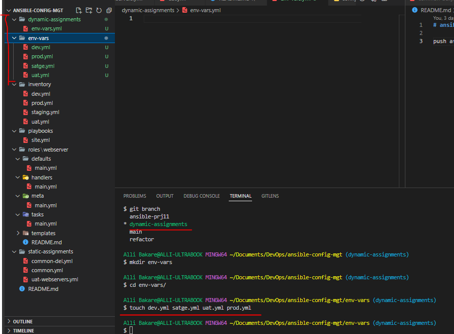
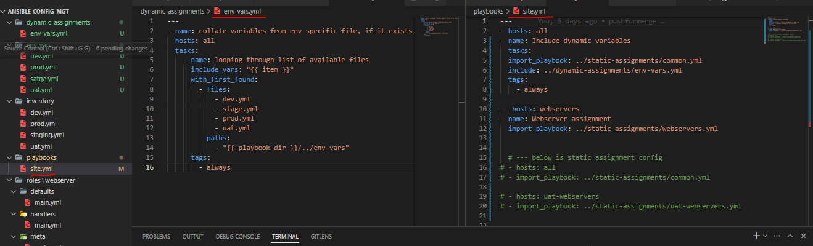

# ANSIBLE DYNAMIC ASSIGNMENTS (INCLUDE) AND COMMUNITY ROLES

In this project I will be making use of dynamic assignments by using include module.

***Static assignments*** uses `import` Ansible module. While ***Dynamic assignments*** uses `include` Ansible module

### Difference between static-assignment and dynamic-assignment

* When the import module is used, all statements are pre-processed at the time playbooks are parsed. Meaning, when you execute site.yml playbook, Ansible will process all the playbooks referenced during the time it is parsing the statements. This also means that, during actual execution, if any statement changes, such statements will not be considered. Hence, it is static.

* On the other hand, when include module is used, all statements are processed only during execution of the playbook. Meaning, after the statements are parsed, any changes to the statements encountered during execution will be used.

## INTRODUCING DYNAMIC ASSIGNMENT INTO OUR STRUCTURE

In the https://github.com/<your-name>/ansible-config-mgt GitHub repository start a new branch and call it `dynamic-assignments`.

`git checkout -b dynamic-assignments`

Create a new folder, name it `dynamic-assignments`. Then inside the created folder, create a new file and name it `env-vars.yml`. We will instruct `site.yml` to include this playbook later. For now, let us keep building up the structure.

* Note: Depending on what method used in the previous project you may have or not have `roles` folder in the GitHub repository – if `ansible-galaxy` was used, then roles directory was only created on your `Jenkins-Ansible` server locally. It is recommended to have all the codes managed and tracked in GitHub, so you might want to recreate this structure manually in this case.

Since we will be using the same `Ansible` to configure multiple environments, and each of these environments will have certain unique attributes, such as `servername`, `ip-address` etc., I will need a way to set values to variables per specific environment.

For this reason, I will now create a folder to keep each environment’s variables file. Therefore, create a new folder `env-vars`, then for each environment, create new `YAML` files which we will use to set variables.

The current layout should look just as below:

```
├── dynamic-assignments
│   └── env-vars.yml
├── env-vars
    └── dev.yml
    └── stage.yml
    └── uat.yml
    └── prod.yml
├── inventory
    └── dev
    └── stage
    └── uat
    └── prod
├── playbooks
    └── site.yml
└── static-assignments
    └── common.yml
    └── webservers.yml
```





Now paste the instruction below into the `env-vars.yml` file.

```
---
- name: collate variables from env specific file, if it exists
  hosts: all
  tasks:
    - name: looping through list of available files
      include_vars: "{{ item }}"
      with_first_found:
        - files:
            - dev.yml
            - stage.yml
            - prod.yml
            - uat.yml
          paths:
            - "{{ playbook_dir }}/../env-vars"
      tags:
        - always
```


## UPDATE SITE.YML WITH DYNAMIC ASSIGNMENTS

I would now update `site.yml` with ***dynamic assignments*** with the code as below:

```
---
- hosts: all
- name: Include dynamic variables 
  tasks:
  import_playbook: ../static-assignments/common.yml 
  include: ../dynamic-assignments/env-vars.yml
  tags:
    - always

-  hosts: webservers
- name: Webserver assignment
  import_playbook: ../static-assignments/webservers.yml
```





### Download Mysql Ansible Role

I can browse available community roles https://galaxy.ansible.com/home

As I will be using a `MySQL role` developed by `geerlingguy`.