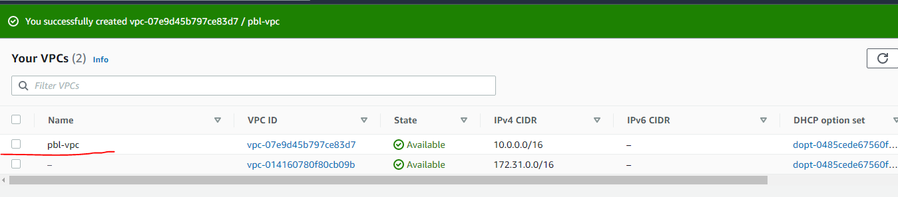
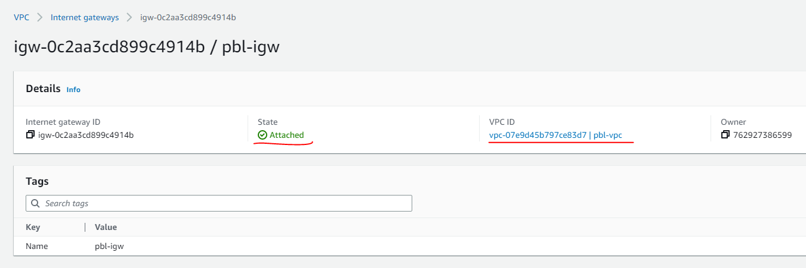
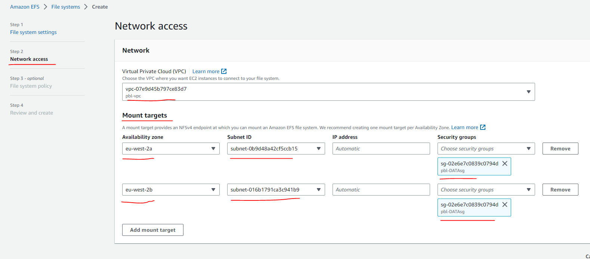
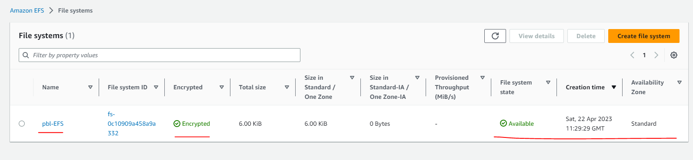
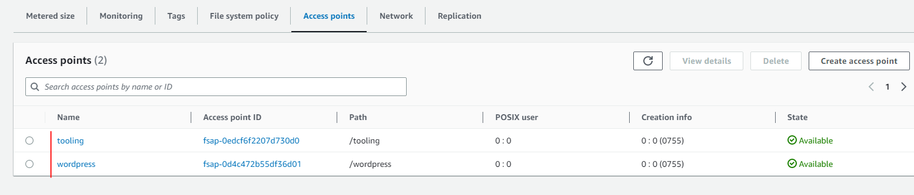
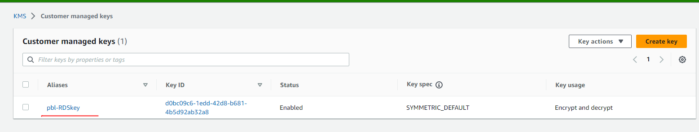
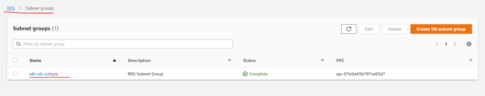
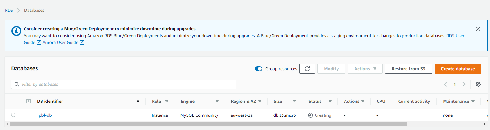

# AWS CLOUD SOLUTION FOR 2 COMPANY WEBSITES USING A REVERSE PROXY TECHNOLOGY

## Introduction

In this project, we will build a secure infrastructure inside AWS VPC (Virtual Private Cloud) network for a fictitious company (Choose an interesting name for it) that uses WordPress CMS for its main business website, and a Tooling Website (https://github.com/(mine)/tooling) for their DevOps team. As part of the company’s desire for improved security and performance, a decision has been made to use a reverse proxy technology from NGINX to achieve this.

*Cost, Security, and Scalability are the major requirements for this project. Hence, implementing the architecture designed below, ensure that infrastructure for both websites, ***WordPress and Tooling***, is resilient to Web Server’s failures, can accomodate to increased traffic and, at the same time, has reasonable cost.*

## 1. Starting Off Your AWS Cloud Project

There are few requirements that must be met before you begin:

1. Properly configure an ***AWS account*** and ***Organization Unit*** [Watch How To Do This Here](https://www.youtube.com/watch?v=9PQYCc_20-Q)

* Create an AWS Master account. (Also known as Root Account)
* Within the Root account, create a sub-account and name it ***DevOps***. (A new email address is required to complete this)
* Within the Root account, create an AWS Organization Unit (OU). Name it ***Dev***. (We will launch Dev resources in there)
* Move the ***DevOps*** account into the ***Dev*** OU.
* Login to the newly created AWS account using the new email address.

2. Create a free domain name for your fictitious company.

3. Create a hosted zone in AWS, and map it to your free domain.

### NOTE : 
As you proceed with configuration, ensure that all resources are appropriately tagged, for example:

Project: <Give your project a name>

Environment: <dev>

Automated: <No> (If you create a recource using an automation tool, it would be <Yes>)

## 2. Setting up infrastructure

1. Create VPC

2. Create subnets as shown in the architecture

3. Create a route table and associate it with public subnets

4. Create a route table and associate it with private subnets

5. Create an [Internet Gateway](https://docs.aws.amazon.com/vpc/latest/userguide/VPC_Internet_Gateway.html) and attach to the PVC

6. Edit a route in public route table, and associate it with the Internet Gateway. (This is what allows a public subnet to be accisble from the Internet)

7. Create [Elastic IPs](https://docs.aws.amazon.com/AWSEC2/latest/UserGuide/elastic-ip-addresses-eip.html)

8. Create a [Nat Gateway](https://docs.aws.amazon.com/vpc/latest/userguide/vpc-nat-gateway.html) and assign the Elastic IPs 

* Updated private route table to talk to the NAT gwt from anywhere within the PVC network

9. Create a [Security Group](https://docs.aws.amazon.com/vpc/latest/userguide/vpc-security-groups.html#CreatingSecurityGroups) for:

* ***Nginx Servers***: Access to Nginx should only be allowed from a Application Load balancer (ALB). At this point, we have not created a load balancer, therefore we will update the rules later. For now, just create it and put some dummy records as a place holder.

* ***Bastion Servers***: Access to the Bastion servers should be allowed only from workstations that need to SSH into the bastion servers. Hence, you can use your workstation public IP address. To get this information, simply go to your terminal and type curl www.canhazip.com

* ***Application Load Balancer***: ALB will be available from the Internet

* ***Webservers***: Access to Webservers should only be allowed from the Nginx servers. Since we do not have the servers created yet, just put some dummy records as a place holder, we will update it later.

* ***Data Layer***: Access to the Data layer, which is comprised of Amazon Relational Database Service (RDS) and Amazon Elastic File System (EFS) must be carefully desinged – only webservers should be able to connect to RDS, while Nginx and Webservers will have access to EFS Mountpoint.

### Proceed With Compute Resources

You will need to set up and configure compute resources inside your VPC. The recources related to compute are:

* EC2 Instances
* Launch Templates
* Target Groups
* Autoscaling Groups
* TLS Certificates
* Application Load Balancers (ALB)

## 3. TLS Certificates From Amazon Certificate Manager (ACM)
You will need TLS certificates to handle secured connectivity to your ***Application Load Balancers*** (ALB).

* Navigate to AWS ACM
* Request a public wildcard certificate for the domain name created
* Use DNS to validate the domain name
* Tag the resource

## Set-up EFS 

[Amazon Elastic File System](https://docs.aws.amazon.com/AWSEC2/latest/UserGuide/AmazonEFS.html) provides a simple, scalable, fully managed elastic Network File System (NFS) for use with AWS Cloud services and on-premises resources. In this project, we will utulize EFS service and mount filesystems on both ***Nginx*** and ***Webservers*** to store data.

* Create an EFS filesystem
* Create an EFS mount target per AZ in the VPC, associate it with both subnets dedicated for data layer
* Associate the Security groups created earlier for data layer.

* Create an EFS access point. (Give it a name wordpress and tooling respectively, POSIX user ID and group ID will be root user ID "0" and permission is "0755")

## Set-up RDS

***Pre-requisite***: Create a KMS key from [Key Management Service](https://docs.aws.amazon.com/AmazonRDS/latest/UserGuide/Welcome.html) to be used to encrypt the database instance.

**Amazon Relational Database Service (Amazon RDS) is a managed distributed relational database service by Amazon Web Services. This web service running in the cloud designed to simplify setup, operations, maintenans & scaling of relational databases. Without RDS, Database Administrators (DBA) have more work to do, due to RDS, some DBAs have become jobless**

To ensure that yout databases are highly available and also have failover support in case one availability zone fails, we will configure a multi-AZ set up of RDS MySQL database instance. In our case, since we are only using 2 AZs, we can only failover to one, but the same concept applies to 3 Availability Zones. We will not consider possible failure of the whole Region, but for this AWS also has a solution – this is a more advanced concept that will be discussed in following projects.

To configure RDS, follow steps below:

* Create a subnet group and add 2 private subnets (data Layer)

* Create an RDS Instance for mysql 8.*.*

* To satisfy our architectural diagram, you will need to select either Dev/Test or Production Sample Template. But to minimize AWS cost, you can select the Do not create a standby instance option under Availability & durability sample template (The production template will enable Multi-AZ deployment)
* Configure other settings accordingly (For test purposes, most of the default settings are good to go). In the real world, you will need to size the database appropriately. You will need to get some information about the usage. If it is a highly transactional database that grows at 10GB weekly, you must bear that in mind while configuring the initial storage allocation, storage autoscaling, and maximum storage threshold.
* Configure VPC and security (ensure the database is not available from the Internet)
* Configure backups and retention
* Encrypt the database using the KMS key created earlier
* Enable CloudWatch monitoring and export Error and Slow Query logs (for production, also include Audit)

