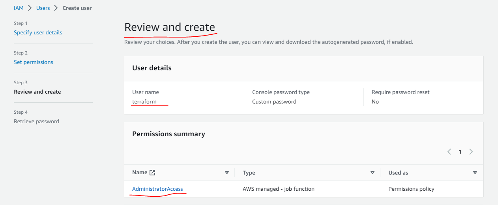
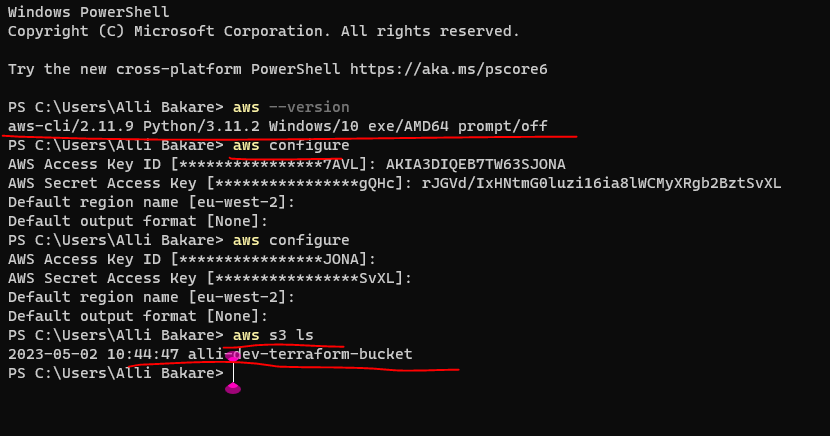
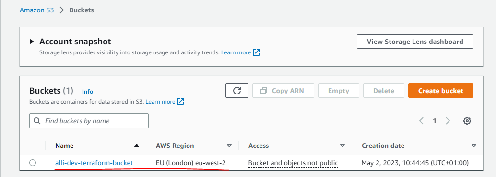

# AUTOMATE INFRASTRUCTURE WITH IAC USING TERRAFORM PART 1

In this project we would build the AWS infrastructure for 2 websites that was built manually in project 15 by automating the process with IaC using Terraform.

1. Create an IAM user, name it terraform (ensure that the user has only programatic access to your AWS account) and grant this user ***AdministratorAccess*** permissions, then copy the secret access key and access key ID. Save them locally temporarily.

2. Configure programmatic access from my workstation to connect to AWS using the access keys copied above and a Python SDK (boto3) ensuring the use of Python 3.6 or higher from my workstation.

3. Create an S3 bucket to store Terraform state file. You can naming it <yourname>-dev-terraform-bucket (Note: S3 bucket names must be unique unique within a region partition, you can read about S3 bucken naming in this article). We will use this bucket from Project-17 onwards.

