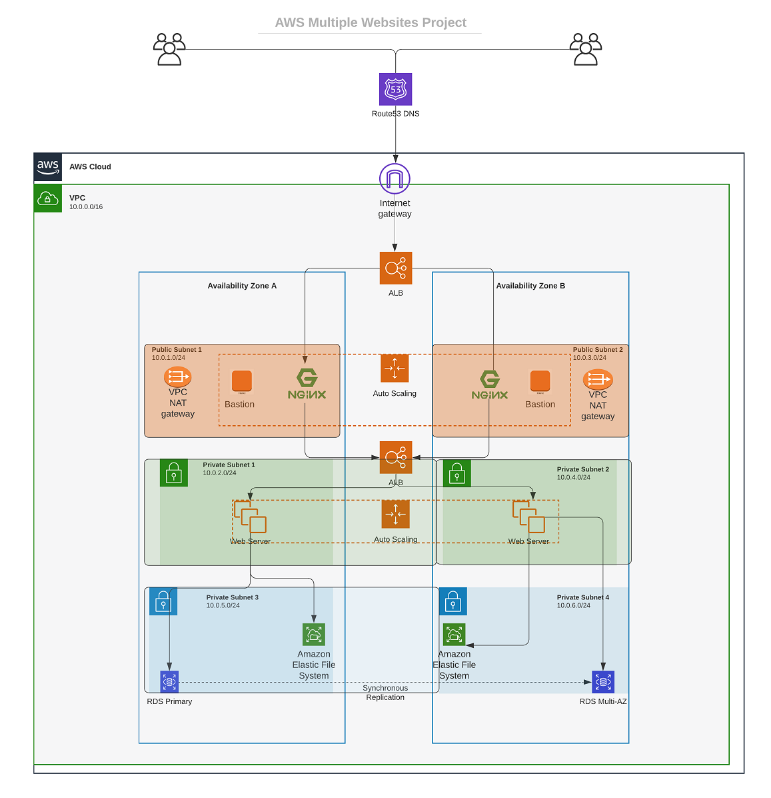

# AUTOMATE INFRASTRUCTURE WITH IAC USING TERRAFORM. PART 2


I will cntinue Infrastructure Automation with `Terraform` from where we left off in Project 16.

Based on the knowledge from the previous project lets keep on creating AWS resources!

## Networking
Private subnets & best practices

According to our infrastructure design from ***project 15 and 16*** below, we will create 4 private subnets keeping in mind following principles:



* Make sure we use `variables or length()` function to determine the number of AZs
* Use `variables and cidrsubnet()` function to allocate `vpc_cidr` for subnets
* Keep `variables` and `resources` in separate files for better code structure and readability
* Tags all the `resources` created so far. Explore how to use `format()` and `count` functions to automatically tag subnets with its respective number.

## STEP 1: Creating Private Subnet

* Creating the private subnet

```
# Create private subnets
resource "aws_subnet" "private" {
  count                   = var.preferred_number_of_private_subnets == null ? length(data.aws_availability_zones.available.names) : var.preferred_number_of_private_subnets
  vpc_id                  = aws_vpc.main.id
  cidr_block              = cidrsubnet(var.vpc_cidr, 8, count.index + 2)
  map_public_ip_on_launch = true
  availability_zone       = data.aws_availability_zones.available.names[count.index]
  tags = merge(
    var.tags,
    {
      Name = format("%s-PrivateSubnet-%s", var.name, count.index)
    },
  )

}
```

The following eeror was experienced when I ran the `terraform plan` command because the available number of AZs in the `eu-west-2` region is 3 and not up to 4 which is declared in the `terraformtfvars` file and in the part of the script for subnets as indicated below:


***line 45***: `availability_zone       = data.aws_availability_zones.available.names[count.index]` meaning this line `preferred_number_of_private_subnets == null ? length(data.aws_availability_zones.available.names) : var.preferred_number_of_private_subnets` will not work as required


Therefore `random_shuffle` resource is introduced and then specifying the maximum subnet:

Though, as a quick measure during the project I used this line in place of the one in the terraform code:


`length(data.aws_availability_zones.available.names) : length(data.aws_availability_zones.available.names)`

```
resource "random_shuffle" "az_list" {
  input        = data.aws_availability_zones.available.names
  result_count = var.max_subnets
}
```

* Now I added tags to all the resources using the format below:

```
tags = merge(
    var.tags,
    {
      Name = "Name of the resource"
    },
  )
```

***NOTE***: Update the `variables.tf` to declare the variable tags used in the format above:

```
variable "name" {
  type        = string
  default     = "desired name"
}

variable "tags" {
  description = "A mapping of tags to assign to all resources."
  type        = map(string)
  default     = {}
}
```


The nice thing about this is – anytime we need to make a change to the tags, we simply do that in one single place `(terraform.tfvars)`.

But, our key-value pairs are hard coded. So, go ahead and work out a fix for that. Simply create variables for each value and use `var.variable_name` as the value to each of the keys.

Apply the same best practices for all other resources you will create further.


## STEP 2: Creating Internet Gateway


* Create a file called `internet_gateway.tf` and update it with the following codes:

```
resource "aws_internet_gateway" "ig" {
  vpc_id = aws_vpc.main.id
  tags = merge(
    var.tags,
    {
      Name = format("%s-%s-%s!", var.name, aws_vpc.main.id, "IG")
    },
  )

}
```
***Note***: I have used the `format()` function to dynamically generate a unique name for this resource? The first part of the `%s` takes the interpolated value of `aws_vpc.main.id` while the second `%s` appends a literal string `IG` and finally an exclamation mark is added in the end.

If any of the resources being created is either using the `count` function, or creating multiple resources using a `loop`, then a key-value pair that needs to be unique must be handled differently.

## STEP 3: Creating NAT Gateway

* Create a file called `nat_gateway.tf` and update it with the following codes to create a NAT gateway and assign an `elastic IP` to it:

```
resource "aws_eip" "nat_eip" {
  vpc        = true
  depends_on = [aws_internet_gateway.ig]

  tags = merge(
    var.tags,
    {
      Name = format("%s-EIP", var.name)
    },
  )
}

resource "aws_nat_gateway" "nat" {
  allocation_id = aws_eip.nat_eip.id
  subnet_id     = element(aws_subnet.public.*.id, 0)
  depends_on    = [aws_internet_gateway.ig]

  tags = merge(
    var.tags,
    {
      Name = format("%s-Nat", var.name)
    },
  )
}
```


## STEP 4: Creating Routes

* Create a file called `route_tables.tf` and update the following codes to create routes for both public and private subnets:


```
# create private route table
resource "aws_route_table" "private-rtb" {
  vpc_id = aws_vpc.main.id

  tags = merge(
    var.tags,
    {
      Name = format("%s-Private-Route-Table", var.name)
    },
  )
}

# associate all private subnets to the private route table
resource "aws_route_table_association" "private-subnets-assoc" {
  count          = length(aws_subnet.private[*].id)
  subnet_id      = element(aws_subnet.private[*].id, count.index)
  route_table_id = aws_route_table.private-rtb.id
}

# create route table for the public subnets
resource "aws_route_table" "public-rtb" {
  vpc_id = aws_vpc.main.id

  tags = merge(
    var.tags,
    {
      Name = format("%s-Public-Route-Table", var.name)
    },
  )
}

# create route for the public route table and attach the internet gateway
resource "aws_route" "public-rtb-route" {
  route_table_id         = aws_route_table.public-rtb.id
  destination_cidr_block = "0.0.0.0/0"
  gateway_id             = aws_internet_gateway.ig.id
}

# associate all public subnets to the public route table
resource "aws_route_table_association" "public-subnets-assoc" {
  count          = length(aws_subnet.public[*].id)
  subnet_id      = element(aws_subnet.public[*].id, count.index)
  route_table_id = aws_route_table.public-rtb.id
}
```


