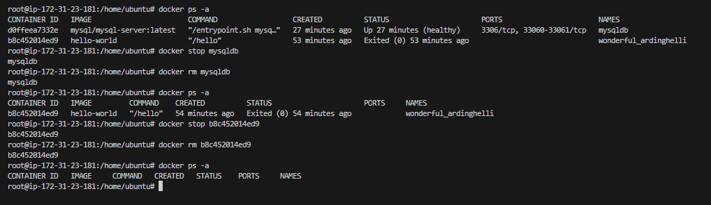
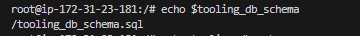
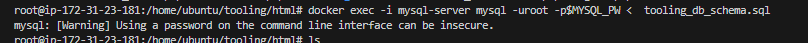
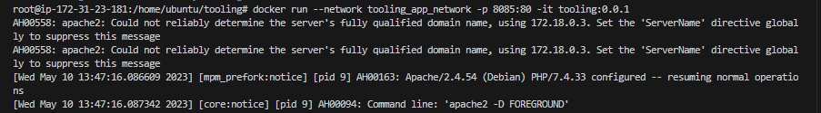

# MIGRATION TO THE СLOUD WITH CONTAINERIZATION. PART 1 – DOCKER & DOCKER COMPOSE


Until now, you have been using VMs (AWS EC2) in Amazon Virtual Private Cloud (AWS VPC) to deploy your web solutions, and it works well in many cases. You have learned how easy to spin up and configure a new EC2 manually or with such tools as Terraform and Ansible to automate provisioning and configuration. You have also deployed two different websites on the same VM; this approach is scalable, but to some extent; imagine what if you need to deploy many small applications (it can be web front-end, web-backend, processing jobs, monitoring, logging solutions, etc.) and some of the applications will require various OS and runtimes of different versions and conflicting dependencies – in such case you would need to spin up serves for each group of applications with the exact OS/runtime/dependencies requirements. When it scales out to tens/hundreds and even thousands of applications (e.g., when we talk of microservice architecture), this approach becomes very tedious and challenging to maintain.

In this project, we will learn how to solve this problem and practice the technology that revolutionized application distribution and deployment back in 2013! We are talking of Containers and imply Docker. Even though there are other application containerization technologies, Docker is the standard and the default choice for shipping your app in a container!

## Install Docker and prepare for migration to the Cloud

First, we need to install `Docker Engine`, which is a client-server application that contains:

* A server with a long-running daemon process `dockerd`.
* APIs that specify interfaces that programs can use to talk to and instruct the `Docker` daemon.
* A command-line interface (CLI) client docker.

This [link](https://docs.docker.com/engine/install/) can be used for the installation of `Docker Engine` based on respective OS paltforms.

## Docker Engine
In this project, I would use an `ubuntu` Linux host as my `Docker Engine` to host my `Docker Containers`

Spin up the Ubuntu based EC2 instance and installed Docker and relevant dependencies

## MySQL in container
Using  a pre-built `MySQL` database container, configure it, and make sure it is ready to receive requests from our PHP application.

***Step 1: Pull MySQL Docker Image from [`Docker Hub Registry`](https://hub.docker.com/)***

Pull `MySql Docker Image` and confirm the image successful download with `docker image ls`

`docker pull mysql/mysql-server:latest`


***Step 2: Deploy the MySQL Container to your Docker Engine***

`docker run --name <container_name> -e MYSQL_ROOT_PASSWORD=<my-secret-pw> -d mysql/mysql-server:latest`


***Step 3: Connecting to the MySQL Docker Container***

I can either connect directly to the container running the MySQL server or use a second container as a MySQL client

**Approach 1**

Connecting directly to the container running the MySQL server using:


```
$ docker exec -it mysql bash

or

$ docker exec -it mysql mysql -uroot -p
```


**Approach 2**

At this stage you are now able to create a docker container but we will need to add a network. So, stop and remove the previous mysql docker container.

```
docker ps -a
docker stop mysql 
docker rm mysql or <container ID> 04a34f46fb98
```



***First, create a network:***

`docker network create --subnet=172.18.0.0/24 tooling_app_network `


Creating a custom network is not necessary because even if we do not create a network, Docker will use the default network for all the containers you run. By default, the network we created above is of `DRIVER Bridge`. So, also, it is the default network. You can verify this by running the `docker network ls` command.

But there are use cases where this is necessary. For example, if there is a requirement to control the cidr range of the containers running the entire application stack. This will be an ideal situation to create a network and specify the `--subnet`

For clarity’s sake, we will create a network with a subnet dedicated for our project and use it for both MySQL and the application so that they can connect.

Run the MySQL Server container using the created network.

First, let us create an environment variable to store the root password:

`export MYSQL_PW=password`

verify the environment variable is created:

`echo $MYSQL_PW`

Then, pull the image and run the container, all in one command like below:

`docker run --network tooling_app_network -h mysqlserverhost --name=mysql-server -e MYSQL_ROOT_PASSWORD=$MYSQL_PW  -d mysql/mysql-server:latest`

Verify the container is running:

`docker ps -a`

As it is best practice not to connect to the MySQL server remotely using the root user. Therefore, we will create an SQL script that will create a user we can use to connect remotely.

Create a file and name it `create_user.sql` and add the below code in the file:

`CREATE USER ''@'%' IDENTIFIED BY ''; GRANT ALL PRIVILEGES ON * . * TO ''@'%';`

Run the script:
Ensure you are in the directory create_user.sql file is located or declare a path

`docker exec -i mysql-server mysql -uroot -p$MYSQL_PW < create_user.sql`


***Note***: If you see a warning like below, it is acceptable to ignore:

`mysql: [Warning] Using a password on the command line interface can be insecure.`

Run the MySQL Client Container:

`docker run --network tooling_app_network --name mysql-client -it --rm mysql mysql -h mysqlserverhost -u  -p` 


## Prepare database schema

Preparing a database schema so that the Tooling application can connect to it.

1. Clone the Tooling-app repository from [here](https://github.com/darey-devops/tooling)

`git clone https://github.com/darey-devops/tooling`


2. Export the location of the SQL file

`export tooling_db_schema=/tooling_db_schema.sql`

Find the `tooling_db_schema.sql` in the `tooling/html/tooling_db_schema.sql` folder of cloned repo

Verify that the path is exported:

`echo $tooling_db_schema`




3. Use the SQL script to create the database and prepare the schema. With the docker exec command, execute the command in a running container.

`docker exec -i mysql-server mysql -uroot -p$MYSQL_PW < $tooling_db_schema`



Update the .env file with connection details to the database


***Note***: The .env file is located in the html `tooling/html/.env` folder but ***not visible in terminal***. 


`sudo vi .env`

```
MYSQL_IP=mysqlserverhost
MYSQL_USER=username
MYSQL_PASS=client-secrete-password
MYSQL_DBNAME=toolingdb
```

5. Run the Tooling App

Run the Tooling App

Containerization of an application starts with creation of a file with a special name - `'Dockerfile'` (without any extensions). This can be considered as a `'recipe'` or `'instruction'` that tells ***Docker*** how to pack your application into a container. In this project, I will build the required container from a pre-created `Dockerfile`.

***Note***: Ensure that the `.env` file have the data of my database and I am inside the `"tooling"`directory that has the file `Dockerfile` to build the container with the command below:

`docker build -t tooling:0.0.1 .`

In the above command, we specify a parameter `-t`, so that the image can be tagged `tooling"0.0.1` - Also, notice the `.` at the end. This is important as that tells `Docker` to locate the `Dockerfile` in the current directory the command is running from. Otherwise, it will be required to specify the ***absolute path*** to the `Dockerfile`.


6. Run the container

`docker run --network tooling_app_network -p 8085:80 -it tooling:0.0.1`

***Note***: There is no name tag for the container, so expect `Docker` to assign a generic name to the container.


I experienced the following error:

`AH00558: apache2: Could not reliably determine the server's fully qualified domain name, using 172.18.0.3. Set the 'ServerName' directive globally to suppress this message`




But resolved this by updating the hostname with `-h` tag as in the command below:

`docker run --rm --name tooling-leey -h ec2-35-177-165-45.eu-west-2.compute.amazonaws.com --network tooling_app_network -p 8089:80 -it tooling:0.0.1`

I also added a name tag


***..........END OF PROJECT..............***
task to update


