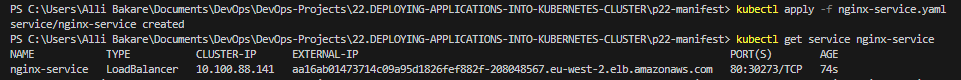

# DEPLOYING APPLICATIONS INTO KUBERNETES CLUSTER


created eks [clusterRole](https://docs.aws.amazon.com/eks/latest/userguide/service_IAM_role.html#create-service-role)

created cluster [nodeRole](https://stackoverflow.com/questions/71087365/aws-eks-cluster-nodes-creation-iam-role)


```
apiVersion: v1
kind: Service
metadata:
  name: nginx-service
spec:
  selector:
    app: nginx-pod
  ports:
    - protocol: TCP
      port: 80
      targetPort: 80
```

`kubectl get service`


Now that we have a service created, how can we access the app? Since there is no public IP address, we can leverage `kubectl's port-forward` functionality.

`kubectl  port-forward svc/nginx-service 8089:80`

`8089` is an arbitrary port number on our laptop or client PC, and we want to tunnel traffic through it to the port number of the `nginx-service` 80.


* From the browser:


* Updated the `ngin-service.yaml` file to:

```
apiVersion: v1
kind: Service
metadata:
  name: nginx-service
spec:
  type: NodePort
  selector:
    app: nginx-pod
  ports:
    - protocol: TCP
      port: 80
      nodePort: 30080
```

`kubectl get service`


* From the browser:


## USING AWS LOAD BALANCER TO ACCESS YOUR SERVICE IN KUBERNETES.

```
apiVersion: v1
kind: Service
metadata:
  name: nginx-service
spec:
  type: LoadBalancer
  selector:
    tier: frontend
  ports:
    - protocol: TCP
      port: 80 # This is the port the Loadbalancer is listening at
      targetPort: 80 # This is the port the container is listening at
```

Apply the configuration:

`kubectl apply -f nginx-service.yaml`

`kubectl get svc`




