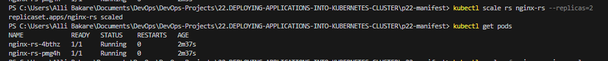
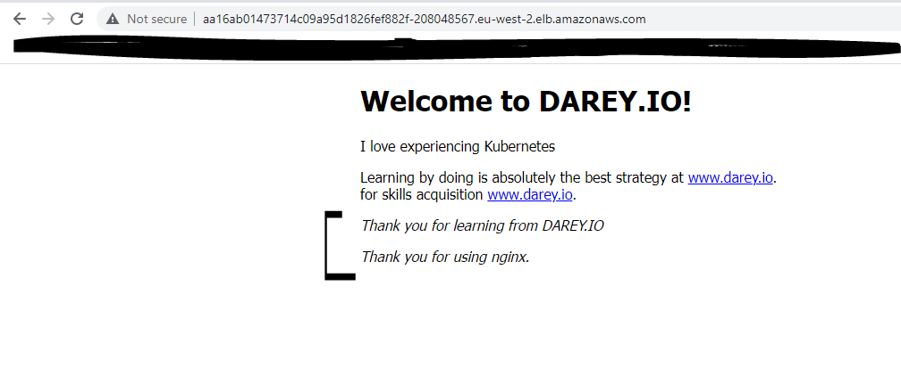

# DEPLOYING APPLICATIONS INTO KUBERNETES CLUSTER

## INTRODUCTION

This project demonstrates how containerised applications are deployed with pods in `Kubernetes` and how to access the application from the browser.

## Step 1: Created a cluster and its prerequisites ([clusterRole](https://docs.aws.amazon.com/eks/latest/userguide/service_IAM_role.html#create-service-role) and [nodeRole](https://stackoverflow.com/questions/71087365/aws-eks-cluster-nodes-creation-iam-role)) using AWS EKS [Doc](https://docs.aws.amazon.com/eks/latest/userguide/getting-started-console.html) and the git hub [repo](https://github.com/weaveworks/eksctl) ensuring communication from PC using `kubectl` command


* Updated the `.kube/config` file using and ran `kubectl get svc` as below: 


* Confirmed the nodes created


* Instances created by the nodes


## Step 2: Creating A Pod For The Nginx Application

Create nginx pod using `nginx-pod.yaml` manifest file created with the code shown below:

```
apiVersion: v1
kind: Pod
metadata:
  name: nginx-pod
  labels:
    app: nginx-pod
spec:
  containers:
    - image: nginx:latest
      name: nginx-pod
      ports:
        - containerPort: 80
          protocol: TCP
```

Run: `kubectl apply -f nginx-pod.yaml` to create the nginx pod, and then the following to validate what was created:

`kubectl get pods`

`kubectl describe pod nginx-pod` or `kubectl get pod nginx-pod -o yaml`


## Step 3: Accessing the App from the browser

Now that I have a running Pod. What’s next?

The ultimate goal of any solution is to access it either through a web portal or some application (e.g., mobile app). We have a Pod with `Nginx container`, so we need to access it from the browser. But all I have is a running Pod that has its own IP address which cannot be accessed through the browser.

To achieve this, I would need another Kubernetes object called `Service` to accept the request and pass it on to the Pod.

A service is an object that accepts requests on behalf of the Pods and forwards it to the Pod’s IP address. If the command below is ran, I will be able to see the `Pod’s IP address`. But there is no way to reach it directly from the outside world.

`kubectl get pod nginx-pod  -o wide` 

Create nginx-service using `nginx-service.yaml` manifest file created with the code shown below:

```
apiVersion: v1
kind: Service
metadata:
  name: nginx-service
spec:
  selector:
    app: nginx-pod
  ports:
    - protocol: TCP
      port: 80
      targetPort: 80
```
Run: `kubectl apply -f nginx-service.yaml` to create the service and then,

`kubectl get service` to confirm the services running:


Now that I have a service created and running, how can we access the app? Since there is no public IP address, we can leverage `kubectl's port-forward` functionality.

`kubectl  port-forward svc/nginx-service 8089:80`

`8089` is an arbitrary port number on our laptop or client PC, and we want to tunnel traffic through it to the port number of the `nginx-service` 80.


* From the browser:


* Updated the `ngin-service.yaml` file to declare a static port to reach the application using `type: NodePort`:

The `Nginx app` acn then be accessed on the browser using the `NodePort` which exposes the service on the decalred static port on the node’s IP address. The nodeports ranges between `30000-32767` by default.

```
apiVersion: v1
kind: Service
metadata:
  name: nginx-service
spec:
  type: NodePort
  selector:
    app: nginx-pod
  ports:
    - protocol: TCP
      port: 80
      nodePort: 30080
```

`kubectl get service`


* From the browser:


## STEP 4: Creating A Replica Set

The `ReplicaSet` object is used to maintain a stable set of Pod replicas running at any given time to achieve availability in case one or two pods dies which can happen anytime

Start by deleting the nginx-pod: `kubectl delete pod nginx-pod`

Then, create the `ReplicaSet` manifest file with the code below and apply it using `kubectl apply -f rs.yaml`

```
apiVersion: apps/v1
kind: ReplicaSet
metadata:
  name: nginx-rs
  labels:
    app: nginx-pod
spec:
  replicas: 2
  selector:
    matchLabels:
      app: nginx-pod
  template:
    metadata:
      name: nginx-pod
      labels:
        app: nginx-pod
    spec:
      containers:
        - name: nginx-pod
          image: nginx:latest
          ports:
            - containerPort: 80
              protocol: TCP
```

* Check the set up with commands below:

`kubectl get rs`

`kubectl get pods`

`kubectl get rs -o wide`


Going ahead to scale `ReplicaSet` up and down:

There are two ways pods can be scaled which are `Imperative` and `Declarative`

Imperative i.e running: `kubectl scale rs ReplicaSetName --replicas=desiredNumber`

And Declarative method is achieved by editing the `rs.yaml` file and changing to the desired number of replicas and applying the update.



## USING AWS LOAD BALANCER TO ACCESS YOUR SERVICE IN KUBERNETES.

```
apiVersion: v1
kind: Service
metadata:
  name: nginx-service
spec:
  type: LoadBalancer
  selector:
    app: nginx-pod
  ports:
    - protocol: TCP
      port: 80 # This is the port the Loadbalancer is listening at
      targetPort: 80 # This is the port the container is listening at
```

Apply the configuration:

`kubectl apply -f nginx-service.yaml`

`kubectl get svc`


Output for running `kubectl get service nginx-service -o yaml` is as seen below showing the dns:

```
apiVersion: v1
kind: Service
metadata:
  annotations:
    kubectl.kubernetes.io/last-applied-configuration: |
      {"apiVersion":"v1","kind":"Service","metadata":{"annotations":{},"name":"nginx-service","namespace":"default"},"spec":{"ports":[{"port":80,"protocol":"TCP","targetPort":80}],"selector":{"app":"nginx-pod"},"type":"LoadBalancer"}}
  creationTimestamp: "2023-05-24T11:43:39Z"
  finalizers:
  - service.kubernetes.io/load-balancer-cleanup
  name: nginx-service
  namespace: default
  resourceVersion: "5976"
  uid: a16ab014-7371-4c09-a95d-1826fef882fc
spec:
  allocateLoadBalancerNodePorts: true
  clusterIP: 10.100.88.141
  clusterIPs:
  - 10.100.88.141
  externalTrafficPolicy: Cluster
  internalTrafficPolicy: Cluster
  ipFamilies:
  - IPv4
  ipFamilyPolicy: SingleStack
  ports:
  - nodePort: 30273
    port: 80
    protocol: TCP
    targetPort: 80
  selector:
    app: nginx-pod
  sessionAffinity: None
  type: LoadBalancer
status:
  loadBalancer:
    ingress:
    - hostname: aa16ab01473714c09a95d1826fef882f-208048567.eu-west-2.elb.amazonaws.com
```





