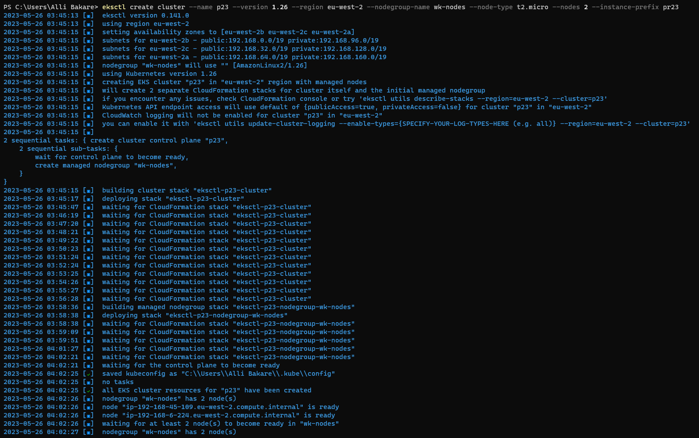
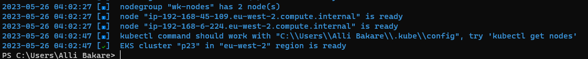
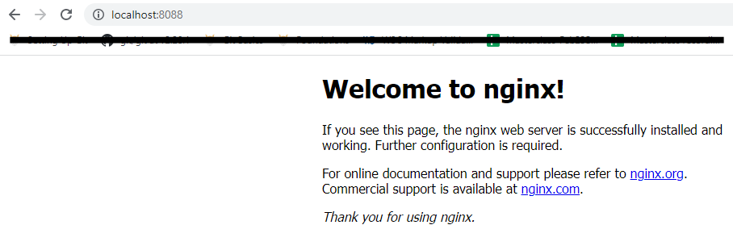
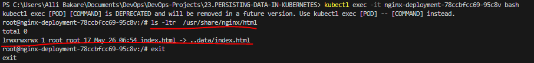
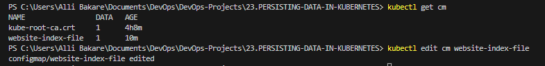
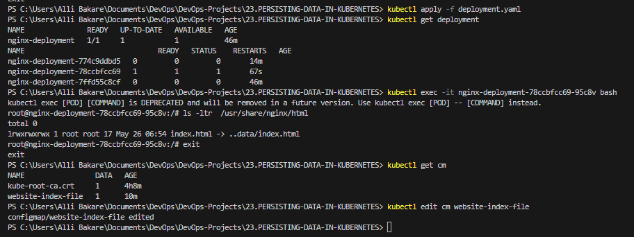
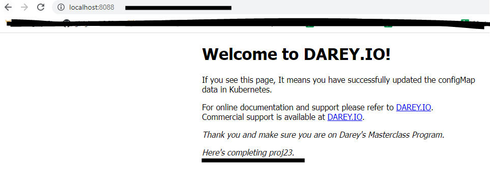

# PERSISTING DATA IN KUBERNETES


## Step 1: Set Up AWS Elastic Kubernetes Service With `EKSCTL`

* Installed [eksctl](https://github.com/weaveworks/eksctl/blob/main/README.md#for-windows-1) using chocolatey and checked version with `eksctl version`


* Ran command from terminal to set up EKS cluster:

`eksctl create cluster --name p23 --version 1.26 --region eu-west-2 --nodegroup-name wk-nodes --node-type t2.micro --nodes 2 --instance-prefix pr23`






Tasks

Verify that the pod is running


Check the logs of the pod


Exec into the pod and navigate to the nginx configuration file /etc/nginx/conf.d


Open the config files to see the default configuration.


* Update the deployment configuration with the volume spec:

```
apiVersion: apps/v1
kind: Deployment
metadata:
  name: nginx-deployment
  labels:
    tier: frontend
    app: nginx-pod
spec:
  replicas: 3
  selector:
    matchLabels:
      tier: frontend
      app: nginx-pod
  template:
    metadata:
      name: nginx-pod
      labels:
        tier: frontend
        app: nginx-pod
    spec:
      containers:
      - name: nginx
        image: nginx:latest
        ports:
        - containerPort: 80
      volumes:
      - name: nginx-volume
        # This AWS EBS volume must already exist.
        awsElasticBlockStore:
          volumeID: "vol-008429efedf353f30"
          fsType: ext4
```

* I did port forward the service and reached the app from the browser on port 8088. 

`kubectl apply -f pf-service.yaml`

```
apiVersion: v1
kind: Service
metadata:
  name: nginx-service
spec:
  selector:
    app: nginx-pod
  ports:
    - protocol: TCP
      port: 80
      targetPort: 80
```

`kubectl  port-forward svc/nginx-service 8088:80`



* Update the deployment configuration with the volume spec and volume mount:

```
apiVersion: apps/v1
kind: Deployment
metadata:
  name: nginx-deployment
  labels:
    tier: frontend
    app: nginx-pod
spec:
  replicas: 1
  selector:
    matchLabels:
      tier: frontend
      app: nginx-pod
  template:
    metadata:
      name: nginx-pod
      labels:
        tier: frontend
        app: nginx-pod
    spec:
      containers:
      - name: nginx
        image: nginx:latest
        ports:
        - containerPort: 80
        volumeMounts:
        - name: nginx-volume
          mountPath: /usr/share/nginx/
      volumes:
      - name: nginx-volume
        awsElasticBlockStore:
          volumeID: "vol-008429efedf353f30"
          fsType: ext4
```

```
apiVersion: apps/v1
kind: Deployment
metadata:
  name: nginx-deployment
  labels:
    tier: frontend
    app: nginx-pod
spec:
  replicas: 2
  selector:
    matchLabels:
      tier: frontend
      app: nginx-pod
  template:
    metadata:
      name: nginx-pod
      labels:
        tier: frontend
        app: nginx-pod
    spec:
      containers:
      - name: nginx
        image: nginx:latest
        ports:
        - containerPort: 80  
        volumeMounts:
        - name: nginx-volume-claim
          mountPath: "/tmp/alli"
      volumes:
      - name: nginx-volume-claim
        persistentVolumeClaim:
          claimName: nginx-volume-claim
```
## Persisting configuration data with configMaps
According to the official documentation of [configMaps](https://kubernetes.io/docs/concepts/configuration/configmap/), A ConfigMap is an API object used to store non-confidential data in key-value pairs. Pods can consume ConfigMaps as environment variables, command-line arguments, or as configuration files in a volume.

In the use case here, I will use configMap to create a file in a volume creating and applying a manifest named `nginx-confimap.yaml` and updating it with the code below:

```
apiVersion: v1
kind: ConfigMap
metadata:
  name: website-index-file
data:
  # file to be mounted inside a volume
  index-file: |
    <!DOCTYPE html>
    <html>
    <head>
    <title>Welcome to nginx!</title>
    <style>
    html { color-scheme: light dark; }
    body { width: 35em; margin: 0 auto;
    font-family: Tahoma, Verdana, Arial, sans-serif; }
    </style>
    </head>
    <body>
    <h1>Welcome to nginx!</h1>
    <p>If you see this page, the nginx web server is successfully installed and
    working. Further configuration is required.</p>

    <p>For online documentation and support please refer to
    <a href="http://nginx.org/">nginx.org</a>.<br/>
    Commercial support is available at
    <a href="http://nginx.com/">nginx.com</a>.</p>

    <p><em>Thank you for using nginx.</em></p>
    </body>
    </html>
```

`kubectl apply -f nginx-configmap.yaml`

* Then I updated the deployment file to use the configmap in the volumeMounts section:

```
apiVersion: apps/v1
kind: Deployment
metadata:
  name: nginx-deployment
  labels:
    tier: frontend
    app: nginx-pod
spec:
  replicas: 1
  selector:
    matchLabels:
      tier: frontend
      app: nginx-pod
  template:
    metadata:
      name: nginx-pod
      labels:
        tier: frontend
        app: nginx-pod
    spec:
      containers:
      - name: nginx
        image: nginx:latest
        ports:
        - containerPort: 80  
        volumeMounts:
          - name: config
            mountPath: /usr/share/nginx/html
            readOnly: true
      volumes:
      - name: config
        configMap:
          name: website-index-file
          items:
          - key: index-file
            path: index.html
```

`kubectl apply -f deployment.yaml`

* Now the `index.html` file is no longer `ephemeral` because it is using a configMap that has been mounted onto the filesystem. This is now evident in the exec output below from the running pod while listing the `/usr/share/nginx/html` directory



It is seen that the `index.html` is now a soft link to `../data`

Though, accessing the app at this point did not change anything because the same `html` file is still in the `configmap`.

But I will go ahead to make changes to the content of the html file through the configmap, and subsequently restart the pod, changes should persist.

* List the available configmaps. You can either use `kubectl get configmap` or `kubectl get cm`

* Update the configmap, either by updating the manifest file, or the kubernetes object directly. I used the latter approach in this case.

`kubectl edit cm website-index-file`




```
apiVersion: v1
kind: ConfigMap
metadata:
  name: website-index-file
data:
  # file to be mounted inside a volume
  index-file: |
    <!DOCTYPE html>
    <html>
    <head>
    <title>Welcome to DAREY.IO!</title>
    <style>
    html { color-scheme: light dark; }
    body { width: 35em; margin: 0 auto;
    font-family: Tahoma, Verdana, Arial, sans-serif; }
    </style>
    </head>
    <body>
    <h1>Welcome to DAREY.IO!</h1>
    <p>If you see this page, It means you have successfully updated the configMap data in Kubernetes.</p>

    <p>For online documentation and support please refer to
    <a href="http://DAREY.IO/">DAREY.IO</a>.<br/>
    Commercial support is available at
    <a href="http://DAREY.IO/">DAREY.IO</a>.</p>

    <p><em>Thank you and make sure you are on Darey's Masterclass Program.</em></p>
    </body>
    </html>
```




* Without restarting the pod, the site should be loaded automatically when the browser is refreshed as seen below:




